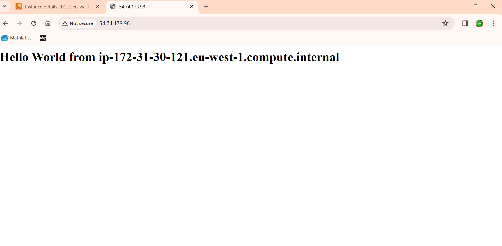

# Creating A VM With Apache Web Server Script

Here I Launched an EC2 instance using a User Data Script on an AWS Linux AMI.


## How to launch the EC2 instance

1. Log into AWS Console using IAM User Credentials.
2. Go to 'EC2' Section and choose 'Instances'.
3. Select 'Launch Instance'.
4. Give it a name, Choose AWS AMI, Select 't2.Micro' Instance Type and Select/Create Key Pair.
5. Select / Create Security group (Allow SSH(:22) and HTTP(:80) for this EC2)
6. Expand 'Advanced Details' and add the following user data:
   - This Script Installs Apache Web Server (httpd)
   - Creates a file named index.html with "HELLO!, World." text<br>
  
```
  #!/bin/bash
# Use this for your user data (script from top to bottom)
# install httpd (Linux 2 version)
yum update -y
yum install -y httpd
systemctl start httpd
systemctl enable httpd
echo "<h1>Hello World from $(hostname -f)</h1>" > /var/www/html/index.html
```

Link to Script File:<br>
- [Apache User Data Script](../ec2-user-data.sh)
  
Web Server Running:<br>
